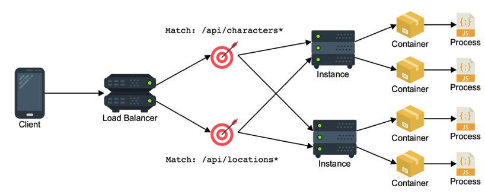
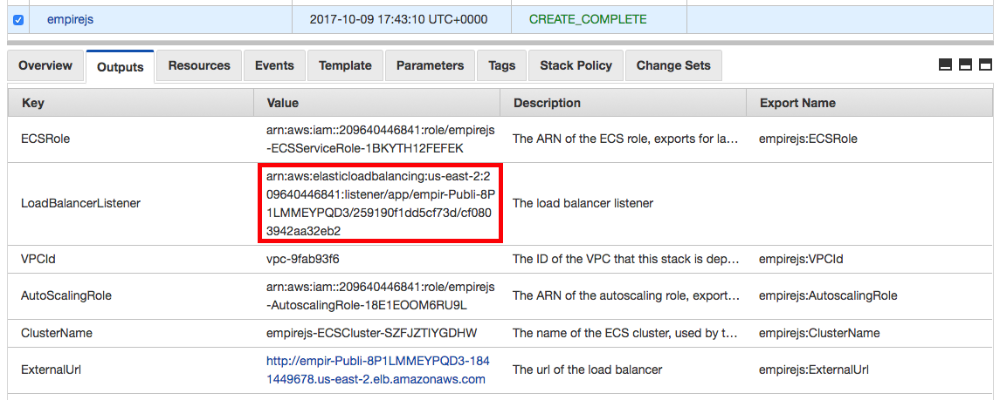
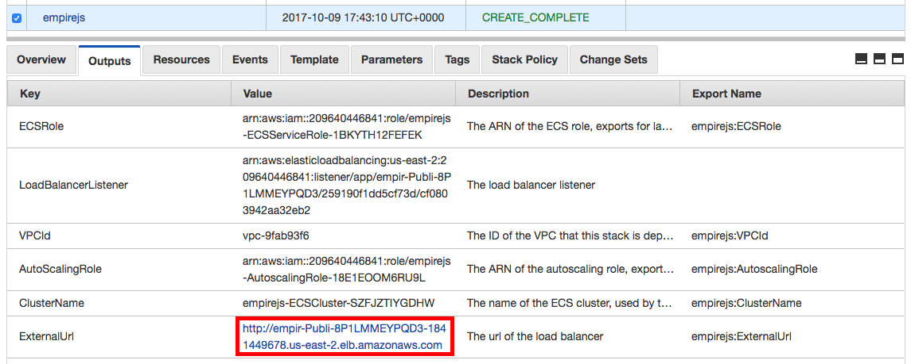
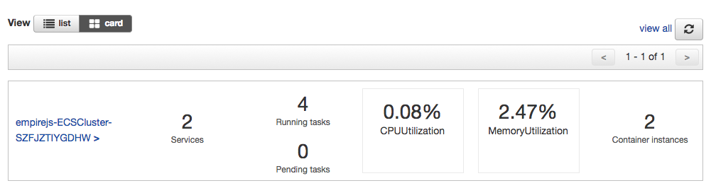
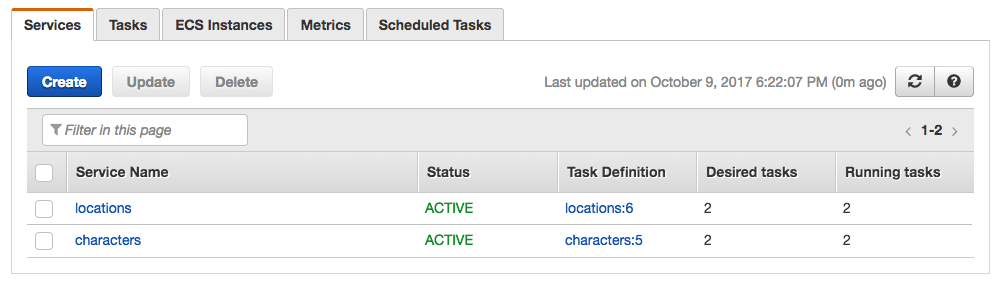
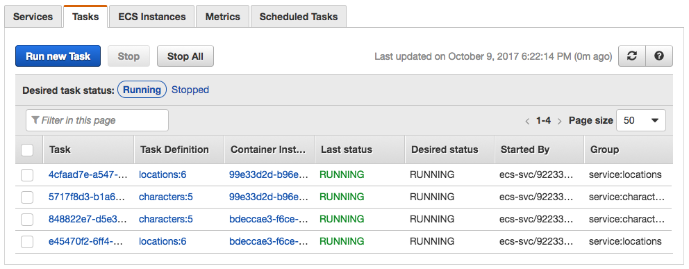
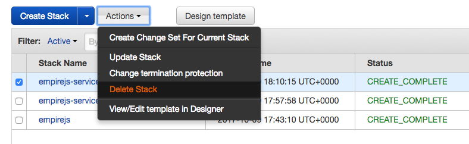
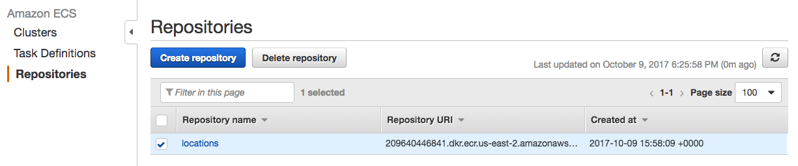

# ACME Insurance Backends on ECS

As a developer you are probably already familiar with how to build and run an application on your local machine:


But the next step is packaging your application up and running it on a server, or even a whole fleet of servers, and managing this can be challenging:


This guide will help you take the same sample Insurance application from localhost to deployed on ECS.

## Sample Application

The sample app is a simple REST API for an Insurance application workfkows. The API provides endpoints to be consumed by step functions.

The external HTTP interface of the API has a basic spec:

- `GET /api/` - A simple welcome message
- `GET /api/approve/:id` - Approve an application by ID
- `GET /api/reject/:id` - Reject an application by ID
- `GET /api/submit/:id` - Submit an application by ID
- `GET /api/find/:id` - Find an application by ID
- `GET /api/flag/:id` - Flag an application by ID for review

## Instructions

# Create a remote development machine

If you are running at home or on your own personal dev machine you technically don't have to use the remote development machine and could instead choose to setup the dev environment on your own machine. This workshop encourages the use of a remote dev machine to avoid variations in personal devices when giving the workshop to many attendees, and additionally to move the burden of package downloads and container uploads onto an AWS internet connection instead of the local wifi connection at the workshop venue. Please follow steps to [create a remote development machine](./SETUP_DEV_MACHINE.md).

# Sample insurance application deployed on AWS using Elastic Container Service



In this workshop we will deploy different microservices as containers running in a cluster of EC2 hosts orchestrated by Elastic Container Service. Traffic will reach the containers through an AWS Application Load Balancer which routes traffic to the four different services based on the path of the request.

## 1. Connect to your development machine

If you have not done so already create [a development machine on AWS](./SETUP_DEV_MACHINE.md) to do this
workshop.

If you don't already have an SSH session open, SSH to your development machine.

```bash
ssh -i ~/.ssh/<your key>.pem ec2-user@<your dev machine ip address>
```

If you haven't already done so clone the workshop code onto the dev machine:

```bash
cd ~/environment
git clone https://github.com/aws-samples/step-functions-ecs-guide
```

Then change your current working directory to the project directory:

```bash
cd step-functions-ecs-guide
```

## 2. Setup environment variables
```bash
export AWS_REGION=$AWS_REGION
export AWS_ACCOUNT_ID=<AWS_ACCOUNT_ID>
```

## 3. Create a container registry for each service

```bash
aws ecr create-repository --repository-name insurance-app/approve --region $AWS_REGION
aws ecr create-repository --repository-name insurance-app/find --region $AWS_REGION
aws ecr create-repository --repository-name insurance-app/flag --region $AWS_REGION
aws ecr create-repository --repository-name insurance-app/reject --region $AWS_REGION
aws ecr create-repository --repository-name insurance-app/submit --region $AWS_REGION
```

You will get output similar to this:

```console
{
    "repository": {
        "registryId": "[your account ID]",
        "repositoryName": "approve",
        "repositoryArn": "arn:aws:ecr:$AWS_REGION:[your account ID]:repository/approve",
        "createdAt": 1507564672.0,
        "repositoryUri": "[your account ID].dkr.ecr.$AWS_REGION.amazonaws.com/approve"
    }
}
```

Take note of the `repositoryUri` value in each response, as you will need to use it later.

Now authenticate with your repository so you have permission to push to it:

- Run `aws ecr get-login-password --region $AWS_REGION | docker login --username AWS --password-stdin $AWS_ACCOUNT_ID.dkr.$AWS_REGION.region.amazonaws.com`

You should see Login Succeeded

## 4. Build and Push

First build each service's container image:

```bash
docker build -t insurance-app/approve src/approve/.
docker build -t insurance-app/find src/find/.
docker build -t insurance-app/flag src/flag/.
docker build -t insurance-app/reject src/reject/.
docker build -t insurance-app/submit src/submit/.
```

Run `docker images` and verify that you see following two container images:

```console
REPOSITORY                TAG                 IMAGE ID            CREATED              SIZE
approve                 latest              ef276a9ad40a        28 seconds ago       58.8 MB
find                latest              702e42d339d9        About a minute ago   58.8 MB
flag                 latest              ef276a9ad40a        28 seconds ago       58.8 MB
reject                latest              702e42d339d9        About a minute ago   58.8 MB
submit                 latest              ef276a9ad40a        28 seconds ago       58.8 MB
```

Then tag the container images and push them to the repository:

```bash
docker tag insurance-app/approve:latest $AWS_ACCOUNT_ID.dkr.ecr.$AWS_REGION.amazonaws.com/insurance-app/approve:v1
docker tag insurance-app/find:latest $AWS_ACCOUNT_ID.dkr.ecr.$AWS_REGION.amazonaws.com/insurance-app/find:v1
docker tag insurance-app/flag:latest $AWS_ACCOUNT_ID.dkr.ecr.$AWS_REGION.amazonaws.com/insurance-app/flag:v1
docker tag insurance-app/reject:latest $AWS_ACCOUNT_ID.dkr.ecr.$AWS_REGION.amazonaws.com/insurance-app/reject:v1
docker tag insurance-app/submit:latest $AWS_ACCOUNT_ID.dkr.ecr.$AWS_REGION.amazonaws.com/insurance-app/submit:v1
```

## 5. Launch a cluster

Use the following command to launch an ECS cluster on your account:

```bash
aws cloudformation deploy --stack-name nodejs --template-file deploy/cluster.yml --region $AWS_REGION --capabilities CAPABILITY_IAM
```

You will see output similar to this:

```console
Waiting for changeset to be created..
Waiting for stack create/update to complete
Successfully created/updated stack - cluster
```

This may take a few minutes, while it creates a new private networking stack, and launches a small cluster of two t2.micro instances on your account. To view the list of resources that is being created [check the cloudformation stack itself](deploy/cluster.yml).

Once the deployment completes you should open [the CloudFormation dashboard](https://$AWS_REGION.console.aws.amazon.com/cloudformation/home?region=$AWS_REGION#/stacks?filter=active) to check the outputs of your newly created CloudFormation stack, as well as [the Elastic Container Service dashboard](https://$AWS_REGION.console.aws.amazon.com/ecs/home?region=$AWS_REGION#/clusters) where you can see your new cluster.

You should select the cluster stack and view the "Outputs" tab, as the next step will require a value from the outputs of this stack.

## 6. Launch your containers as services

To launch the docker containers that we created we will use another CloudFormation stack that automatically creates all the resources necessary to have an autoscaling service in an ECS cluster. Once again I recommend [checking out the stack itself](deploy/service.yml) to understand more about the resources that this stack creates on your account.

Run the following commands, substituting in your own repository URI from step #2 and your own `ListenerArn` from the outputs of the CloudFormation stack run in step #3.



```bash
aws cloudformation deploy \
  --stack-name nodejs-service-appove \
  --template-file deploy/service.yml \
  --region $AWS_REGION \
  --parameter-overrides StackName=nodejs \
                        ServiceName=approve \
                        ListenerArn=<the listener arn from your cluster stack outputs>
                        ImageUrl=<your approve repo URI>:v1 \
                        Path=/api/approve* \
                        Priority=1

aws cloudformation deploy \
  --stack-name nodejs-service-find \
  --template-file deploy/service.yml \
  --region $AWS_REGION \
  --parameter-overrides StackName=nodejs \
                        ServiceName=find \
                        ListenerArn=<the listener arn from your cluster stack outputs>
                        ImageUrl=<your find repo URI>:v1 \
                        Path=/* \
                        Priority=2

aws cloudformation deploy \
  --stack-name nodejs-service-flag \
  --template-file deploy/flag.yml \
  --region $AWS_REGION \
  --parameter-overrides StackName=nodejs \
                        ServiceName=flag \
                        ListenerArn=<the listener arn from your cluster stack outputs>
                        ImageUrl=<your flag repo URI>:v1 \
                        Path=/api/flag* \
                        Priority=1

aws cloudformation deploy \
  --stack-name nodejs-service-reject \
  --template-file deploy/service.yml \
  --region $AWS_REGION \
  --parameter-overrides StackName=nodejs \
                        ServiceName=reject \
                        ListenerArn=<the listener arn from your cluster stack outputs>
                        ImageUrl=<your reject repo URI>:v1 \
                        Path=/api/reject* \
                        Priority=1

aws cloudformation deploy \
  --stack-name nodejs-service-submit \
  --template-file deploy/service.yml \
  --region $AWS_REGION \
  --parameter-overrides StackName=nodejs \
                        ServiceName=submit \
                        ListenerArn=<the listener arn from your cluster stack outputs>
                        ImageUrl=<your submit repo URI>:v1 \
                        Path=/api/submit* \
                        Priority=1                       
```

## 6. Test your new services

Verify that the services are operating by using the URL that is in the outputs of the cluster's CloudFormation stack:



You can fetch a URL from the service API using your browser or curl. For example:

```bash
curl http://empir-publi-8p1lmmeypqd3-1841449678.$AWS_REGION.elb.amazonaws.com/api/characters/by-species/human
```

## 7. Tour the Elastic Container Service dashboard

If you view the AWS console for ECS you will see an overview of your cluster:



Your services:



And your tasks:



From this dashboard you can modify a service to increase the number of tasks that it is running, or you can shutdown tasks, instances, or even entire services.

## 8. Shutdown & Cleanup

Go to the [CloudFormation dashboard on your account](https://$AWS_REGION.console.aws.amazon.com/cloudformation/home?region=$AWS_REGION#/stacks?filter=active) and delete the stacks by selecting them, clicking the "Actions" menu and then clicking "Delete Stack"



Note that you must delete the backend stacks `nodejs-service-approve`, `nodejs-service-find`, `nodejs-service-flag`, `nodejs-service-reject` and `nodejs-service-submit` first. Then you can delete the `nodejs` stack, because there is a dependency between the cluster and the services that prevents the cluster from being deleted until all services have been deleted first.

Finally go to the [repositories tab on the ECS dashboard](https://$AWS_REGION.console.aws.amazon.com/ecs/home?region=$AWS_REGION#/repositories), and select the docker repositories you created, and click "Delete Repository"


